#  <span style="vertical-align: middle;">coq-of-rust</span>

> Formal verification tool for Rust: check 100% of execution cases of your programs 🦀 to make applications with no bugs! ✈️ 🚀 ⚕️ 🏦

Formal verification enables the making of software without bugs by showing that it follows a precise specification in all execution cases, in contrast to testing, which only covers a finite amount of cases.

See our blog post [Verifying an ERC-20 smart contract in Rust](https://formal.land/blog/2023/12/13/rust-verify-erc-20-smart-contract) to have an example of formally verified Rust code using&nbsp;`coq-of-rust`.

The development of `coq-of-rust` was mainly funded by the crypto-currency&nbsp;[Aleph Zero](https://alephzero.org/), to develop safer smart contracts. We thank them for their support!

## Table of Contents

- [Example](#example)
- [Rationale](#rationale)
- [Prerequisites](#prerequisites)
- [Installation and User Guide](#installation-and-user-guide)
- [Features](#language-features)
- [Contact](#contact)
- [Alternative Projects](#alternative-projects)
- [Contributing](#contributing)

## Example
At the heart of `coq-of-rust` is the translation of Rust programs to the [proof system Coq 🐓](https://coq.inria.fr/). Once some Rust code is translated to Coq, it can then be verified using standard proof techniques.

Here is an example of a Rust function:
```rust
fn add_one(x: u32) -> u32 {
    x + 1
}
```
Running `coq-of-rust`, it translates in Coq to:
```coq
Definition add_one (τ : list Ty.t) (α : list Value.t) : M :=
  match τ, α with
  | [], [ x ] =>
    ltac:(M.monadic
      (let x := M.alloc (| x |) in
      BinOp.Panic.add (| M.read (| x |), Value.Integer Integer.U32 1 |)))
  | _, _ => M.impossible
  end.
```
Functions such as&nbsp;`BinOp.Panic.add` are part of the standard library for Rust in Coq that we provide. We can then express and verify specifications on the code in Coq.

## Workflow

Here is the typical workflow of usage for `coq-of-rust`:

```mermaid
graph TB
    R[Rust code 🦀] -- coq-of-rust --> T[Translated code 🐓]
    T -- name resolutions --> L[Linked code 🐓]
    L -- refinement --> S[Simulations 🐓]
    S --> P
    SP[Specifications 🐓] --> P[Proofs 🐓]
    P -.-> X[100% reliable code! 🦄]
```



We start by generating an automatic translation of the Rust we verify to Coq code with `coq-of-rust`. The translation is originally verbose. We go through two semi-automated refinement steps, links and simulations, that gradually make the code more amenable to formal verification.

Finally, we write the **specifications** and **prove** that our Rust program fulfills them **with any possible user input 🔥**.

Examples of typical specifications are:

- The code cannot panic.
- This clever data structure is equivalent to its naive version, except for the execution time.
- This new release, which introduces new endpoints and does a lot of refactoring, is fully backward-compatible with the previous version.
- Data invariants are properly preserved.
- The storage system is sound, as what goes in goes out (this generally amounts to state that the serialization/deserialization functions are inverse).
- The implementation behaves as a special case of what the whitepaper describes once formally expressed.

**With that in hand, you can virtually reduce your code vulnerabilities to zero 🦸!**

## Rationale
Formal verification allows the prevention of all bugs in critical software.

The type system of Rust already offers strong guarantees to avoid bugs that exist in C or Python. We still need to write tests to verify the business rules or the absence of `panic`. Testing is incomplete as it cannot cover all execution cases.

With formal verification, we cover all cases (code 100% bug-free!). We replace the tests with mathematical reasoning on code. You can view it as an extension of the type system but without restrictions on the expressivity.

The tool `coq-of-rust` translates Rust programs to the battle-tested formal verification system Coq to make Rust programs 100% safe&nbsp;🚀.

## Prerequisites

- Rust
- Coq (see [coq-of-rust.opam](./CoqOfRust/coq-of-rust.opam))

## Installation and User Guide

The [build tutorial](./docs/BUILD.md) provides detailed instructions on building and installing `coq-of-rust`, while the [user tutorial](./docs/GUIDE.md) provides an introduction to the `coq-of-rust` command line interface and the list of supported options.

## Language features
The translation works at the level of the [THIR](https://rustc-dev-guide.rust-lang.org/thir.html) intermediate representation of Rust.

We support 99% of the Rust examples from the [Rust Book by Examples](https://doc.rust-lang.org/rust-by-example/). This includes:

- basic control structures (like&nbsp;`if` and&nbsp;`match`)
- loops (`while` and&nbsp;`for`)
- references and mutability (`&` and&nbsp;`&mut`)
- closures
- panics
- user types (with&nbsp;`struct` and&nbsp;`enum`)
- the definition of traits
- the implementation keyword&nbsp;`impl` for traits or user types

## Contact
For formal verification services on your Rust code base, contact us at [&#099;&#111;&#110;&#116;&#097;&#099;&#116;&#064;formal&#046;&#108;&#097;&#110;&#100;](mailto:contact@formal.land). Formal verification can apply to smart contracts, database engines, or any critical Rust project. This provides the highest confidence level in the absence of bugs compared to other techniques, such as manual reviews or testing.

## Alternative Projects

Here are other projects working on formal verification for Rust:

- [Aeneas](https://github.com/AeneasVerif/aeneas): Translation from MIR to purely functional Coq/F* code. Automatically put the code in a functional form. See their paper [Aeneas: Rust verification by functional translation](https://dl.acm.org/doi/abs/10.1145/3547647).
- [Hacspec v2](https://github.com/hacspec/hacspec-v2): Translation from THIR to Coq/F* code
- [Creusot](https://github.com/xldenis/creusot): Translation from MIR to Why3 (and then SMT solvers)
- [Verus](https://github.com/verus-lang/verus): Automatic verification for Rust with annotations
- [Kani](https://github.com/model-checking/kani): Model-checking with [CBMC](https://github.com/diffblue/cbmc)

## Contributing
This is all open-source software.

Open some pull requests or issues to contribute to this project. All contributions are welcome! This project is open-source under license AGPL for the Rust code (the translator) and MIT for the Coq libraries. There is a bit of code taken from the [Creusot](https://github.com/xldenis/creusot) project to make the Cargo command `coq-of-rust` and run the translation in the same context as Cargo.
