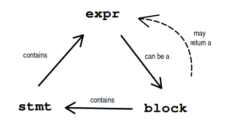

# Translation

In this doc we specify how the translation works and the details of
the translation together with the target language. It should proceed
by iterating over the Rust features and specifying the translation
together with one or more examples of the translation.

## A note about notation in this document
I use brackets to represent how the translation recurse, together
with an example in Rust, followed by a horizontal rule, followed
by an example in Coq. Here is an example. If there are brackets
ocurring in the expression we may use double brackets for the
translation flow to avoid confusion.

```
     [a + 1]
------------------
Pure ([a] [+] [1])
```

I also use ellipsis `...` to mean the more code that is not significative
for the current context. If more than one ellipsis is used I number it
to make each one distinct. For example

```
     [let foo = bar; ...]
------------------------------
   let foo := [bar] in [...]
```

```
       [match x { Ctr0 ...0 => ...1 }]
---------------------------------------------
    match [x] with [Ctrl0 ...0] => [...1] end
```

## M - The Monad

_See: [PR 58](https://github.com/formal-land/coq-of-rust/pull/58/files#diff-7333cfd320f9b3335b66aa12653cbe8ae17310ff381a1c00d5c101f8ac412c50)_

This is a monad to represent various impure constructs from Rust. It will
be used in the translation.

```Coq
Module M.
  (** Monad for impure Rust code. The parameter [R] is for the type of the
      returned value in a block. *)
  Inductive t (R A : Set) : Set :=
  | Pure : A -> t R A
  | Bind {B : Set} : t R B -> (B -> t R A) -> t R A
  | FunctionCall : t Empty_set A -> t R A
  (** This is the Rust's `return`, not the one of the monad *)
  | Return : R -> t R A
  | Break : t R A
  | Continue : t R A
  | Panic {E : Set} : E -> t R A.
  Arguments Pure {_ _}.
  Arguments Bind {_ _ _}.
  Arguments FunctionCall {_ _}.
  Arguments Return {_ _}.
  Arguments Break {_ _}.
  Arguments Continue {_ _}.
  Arguments Panic {_ _ _}.
End M.
```

## Expressions, Statements and Blocks relation

In Rust, expressions, statements and block are closely related, because
a block, which contains a sequence of statements, may return a value,
and be part of outer expression. So it is like expressions can have
statements which have expressions on it.




## Statements

Statements are sequences of expressions that are evaluated in the order they appear
and that may introduce new names.

From [Rust reference](https://doc.rust-lang.org/reference/statements.html):
```
Syntax
Statement : 
     ;
   | Item
   | LetStatement
   | ExpressionStatement
   | MacroInvocationSemi
``` 

### Item (Statement)

@TODO I didn't get what is an item statement yet

### LetStatement

From [Rust reference](https://doc.rust-lang.org/reference/statements.html#let-statements)

```
Syntax
LetStatement :
   OuterAttribute* let PatternNoTopAlt ( : Type )? (= Expression † ( else BlockExpression) ? ) ? ;
 † When an else block is specified, the Expression must not be a LazyBooleanExpression, or end with a }.
```

@TODO Add the 

`LetStatement` declare variables introducing new names to the
statements following it. It is possible to use desconstruction
together with let in Rust as we do in Coq, but Rust has a optional
`else` block for the `let` statement.

Rust has the notion of refutable and irrefutable pattern. Irrefutable
can be though as an ADT with a single constructor so it has only
one pattern that a value of such type can match, if the pattern is
refutable, then the `else` block is mandatory.

From 

```Rust
let foo = true;
let bar = foo;
let x = Some 1;
let Some y = x else { panic!() };
```

Translation ideas

```
   [let foo = a; ...]
--------------------------
let foo := [a] in [...]
```

If  `[a]` is impure we need to use the monadic notation

```
  [let foo = a; ...]
------------------------
let** foo := [a] in [...]
```
* Note that `let*` will drive the type of `...`.
* @TODO Can we know if `a` is impore or not?
* @TODO `foo` is bounded in `...`. I had to take this into account
  in coq-of-solidity because when I find the identifier `foo` inside
  the `...` I need to know if it was local or not, to guide the translation.
  Non local variables, i.e., state variables were translated to `state.(foo)`
  while local variables stays like `foo`. In coq-of-solidity I use a map
  as an environment to keep the scope of the variables (among other
  things). I think that this is not a problem in rust because `self`
  need to be explicited in order to be accessed.
  
Let with pattern

```
     [let Ctr foo = a; ...]
-------------------------------
  let* 'Ctr foo := [a] in [...]

```

Let with pattern and else

```
[let Ctr foo = a else { ...0 ] }; ...1 ]
----------------------------------------
       let** foo := match [a] with 
         | Ctr foo => [a] 
         | _ => [ ...0 ]
         end in
         [ ...1 ]
```

* @TODO: Understand the `let**` notation, I'm just guessing that it
  is the right choice here for now.

### ExpressionStatement

From [Rust reference](https://doc.rust-lang.org/reference/statements.html#expression-statements)

```
Syntax
ExpressionStatement :
     ExpressionWithoutBlock ;
   | ExpressionWithBlock ;?
```

`ExpressionStatement` is when a expression is used in the place of a statement, its value
is ignored. For example

```Rust
true; // ignore this result
0
```

We already have a notation for this in Coq, and it matches the
sequence notation `;;`, see
[this](https://github.com/formal-land/coq-of-rust/pull/58/files#diff-7333cfd320f9b3335b66aa12653cbe8ae17310ff381a1c00d5c101f8ac412c50)

```
      [a; ...]
-------------------
    [a] ;; [...]
```

* In this case `a` is not a let statement, if it was then the let statement rule would be used.

### MacroInvocationSemi

Macros are expanded before coq-of-rust run, so we don't need to bother with them.

* @TODO is this true?


## Expressions

* Reference: https://doc.rust-lang.org/reference/expressions.html

### Pure expressions

* TODO: 
  * [] Give an explanation of what is pure expressions, and how function calls
      may not be pure because the can panic
  * [] Get the name of the AST that we work in the translation (there are multiple
       for multiple phases.
  * [] Can we know if an expressions is pure or not from the AST?
  * [] Should we assume that all funcitions are impure (because they can panic)? By
       doing so we don't need to inspect the function body to tell if
       its pure or inpure during the translation.

Pure expressions must be wrapped in `Pure` constructor of [#M](#M)

Examples:


```
  [1]
------
Pure 1
```

```
   [if cond { then_body } else { else_body }]
-------------------------------------------------
Pure (if [cond] then [then_body] else [else_body])
```
* TODO: In fact if may not be pure because of the _then_ body!?
  * In coq-of-solidity I had to iterate over the expressions looking
    for function calls, for other reason, but this can be used in the
    translation to tell if an if expression is pure or not.

## Function calls

```
  [f(a, b)]
-------------
 f(|[a] [b]|)
```

Where `f(| ... |)` is a notation in Coq.
_See [PR 58](https://github.com/formal-land/coq-of-rust/pull/58/files#diff-7333cfd320f9b3335b66aa12653cbe8ae17310ff381a1c00d5c101f8ac412c50R111)_
